# Gilwing

## Mecenazgo y donaciones descentralizadas

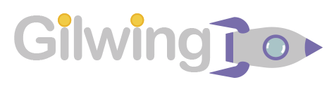

---

### Índice

- [Introducción](#introducción)

  - [Datos del proyecto](#datos)
  - [Descripción del proyecto](#descripción-del-proyecto)
  - [Objetivos](#objetivos)
  - [Tecnologías](#tecnologías)
  
- [Desarrollo](#desarrollo)
  
  - [Planificación](#planificación)

    - [Gantt](#gantt)
    - [Distribución del tiempo](#distribución-del-tiempo)

  - [Análisis previo](#análisis-previo)

    - [Historias de usuario](#historias-de-usuario)
    - [Modelo de datos](#modelo-de-datos)
    - [Wireframes](#wireframes)

  - [Proceso de implementación](#proceso-de-implementación)

    - [Fases](#fases)
    - [Problemas](#problemas)
    - [Metodologías](#metodologías)

  - [Producción](#producción)
  
    - [Resultado final](#resultado-final)
    - [Despliegue](#despliegue)

  - [Resultados y conclusiones](#resultados-y-conclusiones)

  - [Bibliografía](#bibliografía)

Antes de empezar a usar la aplicación recomendamos usar esta guia para la instalación y configuración de Metamask:

#### [Como usar Metamask con Gilwing](./doc/howToUse/howToUse.md)

## Introducción

---

### Datos

---
> Título: Gilwing
> Alumno: Víctor Porlan Soto
> Cíclo: DAW DUAL
> Fecha de entrega: 08/06/2022
> [Despliegue del proyecto](https://gilwing.ddns.net)

Este proyecto se trata de mi proyecto final de grado de Desarrollo de Aplicaciones Web DUAL, y es una aplicación basada en Ethereum y en la blockchain para realizar donaciones totalmente transparentes y visibles para cualquier usuario que desee ver en qué se está usando el dinero que ha donado.

Este proyecto surje por dos motivos, el primero siendo el evidente incremento en el interés en todo este tipo de tecnologías descentralizadas y por el rumbo hacia la descentralización que está tomando la web, y el otro motivo se trata de nuestro tutor [David Gelpi](https://github.com/dfleta), el cual comentó que aún no habia visto ningún proyecto con esta temática. Al oír esto sentí bastante curiosidad y que era un desafío lo suficientemente interesante para el proyecto final.

### Descripción del proyecto

---

El objetivo de Gilwing es conseguir una plataforma de mecenazgo y donaciones totalmente descentralizada y tansparente, dando la posibilidad a cualquier usuario de ver las transacciones que ha realizado un proyecto y las donaciones que ha recibido. A la hora de crear un proyecto se pide un título, una descripción y un mínimo de donaciones en Wei.

En la página de detalles de una campaña los usuarios podrán ver los donantes y las transacciones realizadas, además de la cantidad de ether almacenado en el smart contract seleccionado. El mánager de la campaña verá una pestaña de transacciones en la que podrá enviar dinero dando una descripción y la dirección del receptor.

Un usuario normal verá una pestaña de donaciones en la cual podrá dar un nombre y poner un comentario a la donación. En el caso de que no se rellenen estos campos aparecerá como "Anon" y con el comentario: "Sin comentario". Si deseas donar por segunda vez con la misma dirección, se usará tu perfil de donante que se creó en la primera donación, haciendo que aparezca junto a las otras donaciones realizadas bajo esa dirección.

### Objetivos

---

#### Objetivos de software

Con Gilwing buscamos el poder hacer una plataforma de donaciones honesta y transparente, donde los dueños de las campañas se verán obligados a mostrar en todo momento de cuánto dinero disponen en la campaña y las transacciones realizadas.

Almacenando el dinero en el smart contract en lugar de en su cuenta podemos mantener un seguimiento de lo que se realiza con el dinero de las donaciones en todo momento, de esta forma la gente se sentirá mas tranquila a la hora de donar.

#### Objetivos personales

Con este proyecto pretendo mostrar las utilidades que aporta la web descentralizada y la web 3. La bnlockchain ofrece una gran transparencia y una seguridad muy robusta, ya que la capacidad computacional requerida para "hackearla" es cada vez más y más grande.

### Tecnologías

---

#### React

- Es el framework (o librería) principal utilizada para el frontend. Por lo general es uno de los frameworks más utilizados por mi parte y con el que mejor me manejo. Considero que los hooks aportan una gran utilidad cuando aprendes a utilizarlos, y la responsividad es una característica básica en cualquier frontend actualmente.

#### Extras de react

- React router (generación de rutas), Material ui (librería de diseño y componentes de react).

#### Mocha

- Framework de testing JS, se ha usado principalmente para el testeo de la funcionalidad de los smart contracts.

#### Web3

- Principal librería de blockchain y criptomonedas de JS actualmente, aporta una increíble variedad de utilidades a la hora de trabajar con ellas, tanto a la hora de desplegar smart contracts, generar cuentas de prueba, testing, conversión de divisas. Es la tecnología más importante de este proyecto.

#### Infura

- Web3 necesita de un nodo con el que poder conectarse a la blockchain, y en lugar de invertir horas en la  creación y gestión un nodo propio en local se ha usado la plataforma Infura para la conexión a la red de testeo designada.

#### Truffle

- Actúa a modo de proveedor para Web3. Utilizando tu mnemonic phrase (frase de 12 palabras que te dan al generar tu address en cualquier wallet) y la url de tu proyecto de Infura podremos poner a funcionar Web3 muy sencillamente, ya que sin un provider Web 3 no tiene a penas usos.

#### Ganache

- Generador de providers a redes internas y una blockchain ficticia. Se ha usado para el testing de la aplicación, ya que al trabajar en una blockchain interna el tiempo de espera será mínimo. No se ha usado en el desarrollo de la aplicación ya que es necesario ver los tiempos reales de carga durante el desarrollo para poder experimentar la UX final del usuario.

#### Solidity / Remix

- Para la codificación de los smart contracts se ha usado el lenguaje de programación Solidity (0.8.9) con el IDE Remix, que aporta gran variedad de utilidades como el despliegue de smart contracts al alcance de un botón, elección de versión de compilador, etc.

#### Factory

- Un gran problema a la hora de la gestión de una aplicación basada en la blockchain es el despliegue y gestión de los contratos. Ya que si permitimos que sean los usuarios los encargados del despliegue existen múltiples formas de desplegar smart contracts muy similares a los usados en nuestra aplicación pero modificados para resultados fraudulentos y nocivos. Si desplegamos nosotros, los desarrolladores, los contratos tendremos pérdidas de currency en gran medida ya que el despliegue tiene un costo, y es por esto que siempre es conveniente dejarlo de lado del usuario.

- Para solucionar este problema se ha utilizado una factory con una address fija, desde la cual se puede desplegar campañas, que se almacenarán en un map de addresses, permitiéndonos también delegar el pago al usuario sin darle la oportunidad de desplegarlo él directamente.

## Desarrollo

---

### Planificación

---

### Gantt

---

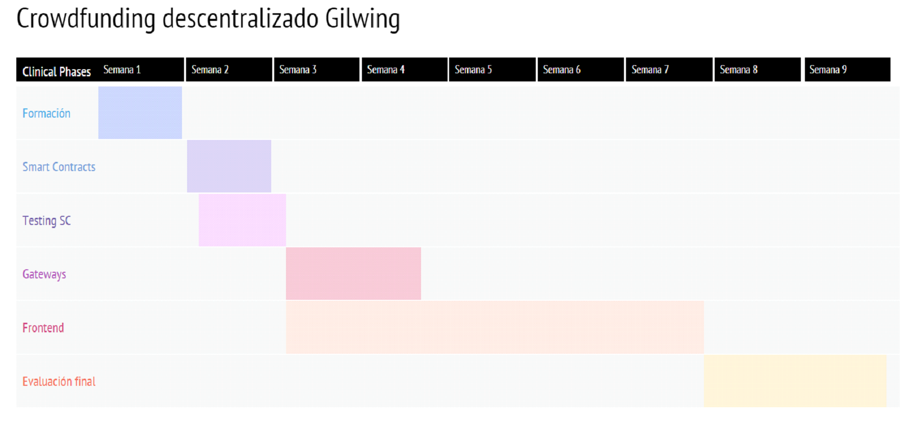

Esta fue la planificación inicial del tiempo que se estimó antes de empezar el desarrollo de la aplicación. Ha resultado ser bastante acertado en la distribución del tiempo como veremos más adelante. Algo a destacar es que se optó por eliminar la parte de un diseño de Gateways ya que se consideró innecesario para la estructura de la aplicación. Si se hubiera optado por el uso de una api si que hubiera sido garantizada la implementación de esta parte del proyecto.

### Distribución del tiempo

---

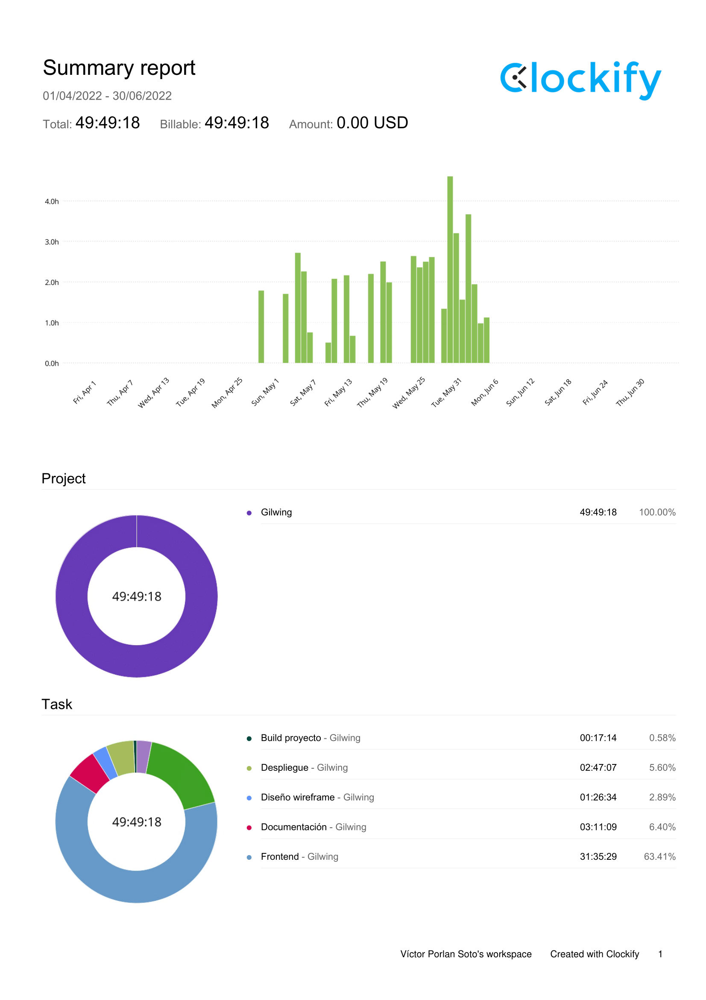

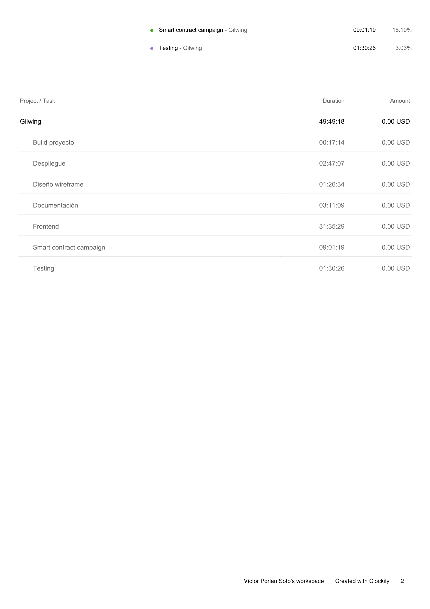

Como he mencionado antes, la distribución del tiempo ha sido bastante acertada cuando la comparamos con el diagrama de Gantt, yendo gran parte del tiempo al diseño del frontend y a la funcionalidad del mismo. Una parte que se me olvidó incluir en el diagrama de Gantt fue el tiempo de despliegue, el cual fue bastante simple y rápido, asi que incluso se podría añadir en la parte de frontend.

### Análisis previo

---

### Historias de usuario

#### Crear una campaña

Primero, vamos a ver el proceso que seguría una persona que decide CREAR una campaña.

Accedemos al formulario de creación de campaña, en el que nos pedirán un título, una descripción y un mínimo en Wei (1 ethereum son 1,000,000,000,000,000,000 wei).

Una vez creada le redirige a su campaña, y en cualquier momento podrá acceder a esta desde la sección de "Mis campañas".

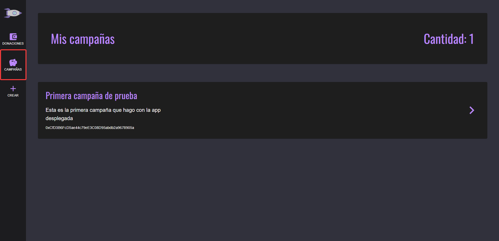

Una vez haya creado su campaña podrá acceder a esta para usar el formulario de transacciones. En este tendrá que aportar una descripción, una dirección (address del usuario en la blockchain) para el envío y la cantidad a enviar.

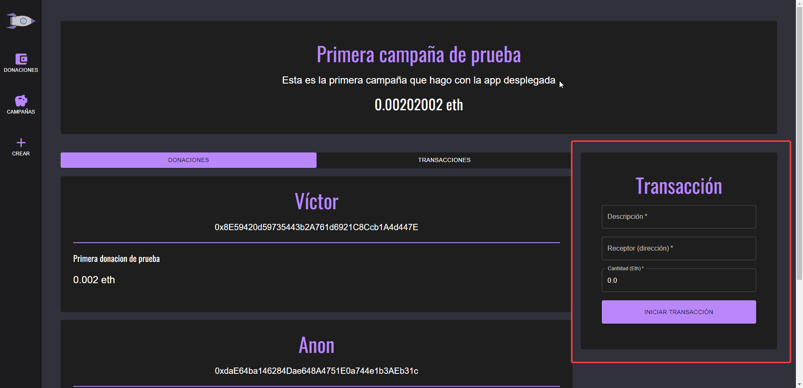

#### Donar a una campaña

Por último tenemos la historia de usuario de un donante.

Para encontrar campañas el usuario puede acceder a la landing page, donde encontrará diferentes campañas de muestra, y también podrá usar un buscador para encontrar campañas directas las cuales ya conozca.

Al seleccionar una campaña tendremos la opción de donar, mediante un formulario que nos pide un nombre, un comentario y una cantidad para donar. En el caso de que el nombre se deje vacío aparecerá como "Anon" y si no pone comentario aparecerá "Sin comentario".

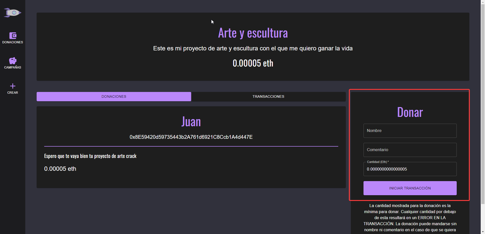

Si el usuario así lo quiere podrá volver a donar a la misma campaña. Se recordará el perfil del donante a la hora de donar y se guardará la donación en la misma card que la otra donación bajo el mismo perfil.

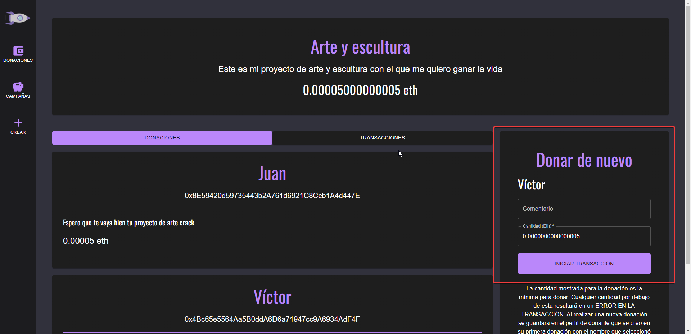

### Modelo de datos

---

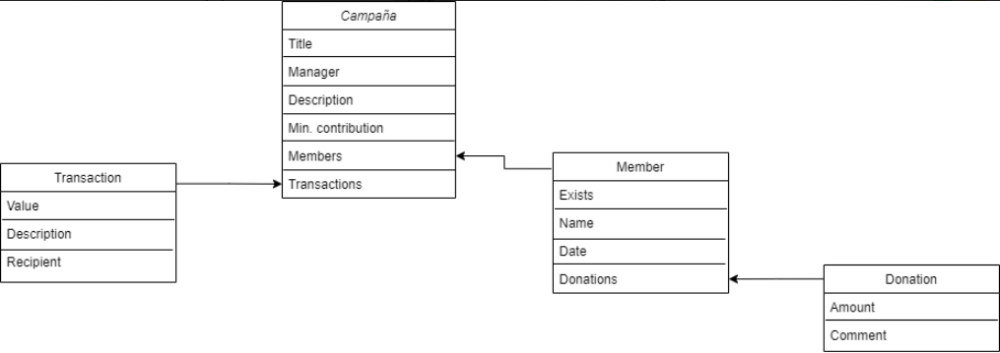

### Wireframes

---

Aqui voy a mostrar los diseños iniciales que se crearon para la aplicación de las páginas principales, junto al diseño final que se ha hecho. Faltan algunos diseños de páginas que era muy simples, como por ejemplo un formulario de creación o una lista de campañas, las cuales no consideré necesarias diseñarles un wireframe por su simplicidad.

#### Landing page

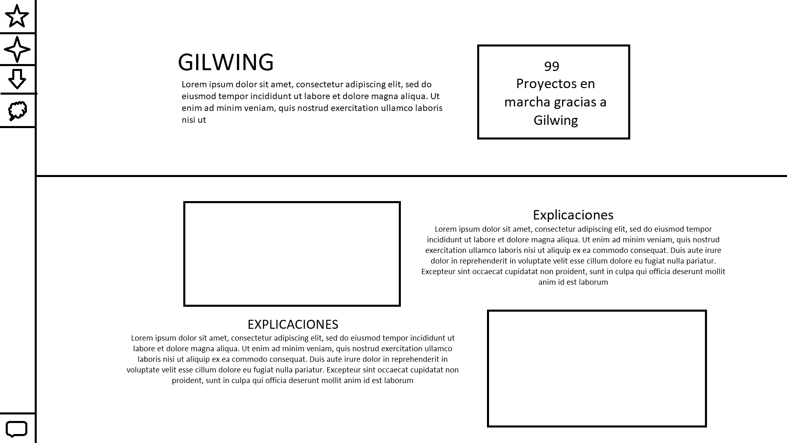

Como podemos comprobar se acabó optando por un diseño más funcional, el cual muestra una lista de campañas creadas para hacer que la página inicial sea más práctica y no tan solo informativa.

#### Detalles de campaña

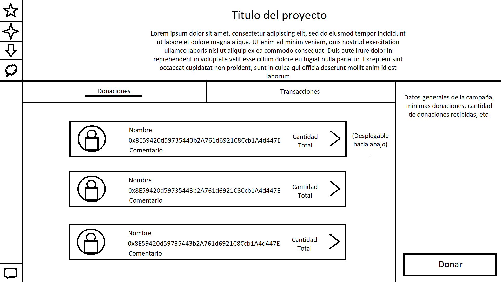

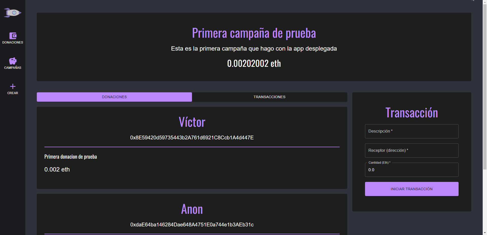

En un pricipio se planteó el uso de una librería de generación aleatoria de fotos de perfil, las cuales se generarían en base a la address del usuario, pero sentí que rompería con la estética de la aplicación en gran medida, ya que algunos rompían la paleta de colores utilizada en la web. Las cards también crecieron en tamaño por el sistema de perfiles que se implementó en la aplicación durante el desarrollo.

### Proceso de implementación

---

#### Fases

---

- **Smart contracts**: El desarrollo de la aplicación empezó creando los dos smart contracts de la aplicación, Factory y Campaign. La Factory es simplemente un intermediario entre el usuario y la creación de las campañas para mantener el proceso bajo control, y en Campaign encontramos toda la lógica básica de la aplicación.

- **Testing**: En esta fase se hizo el testeo de las funciones básicas de los smart contracts.

- **Diseño de wireframes**: Durante esta fase se hicieron los wireframes y se encargó el logo de la aplicación.

- **Frontend**: Basándose en los wireframes anteriormente diseñados, se hizo un frontend reactivo con una paleta de colores homogénea y sin demasiados colores, optando por un tema oscuro y agradable a la vista. Durante esta fase también se hizo la unión entre el frontend y la blockchain, la cual se especuló en el anteproyecto que se haría con unos Gateways, pero esta idea fue finalmente descartada.

- **Despliegue**: Usando un servidor cloud de Ionos, se desplegó la aplicación utilizando Apache, y para poder utilizar **https** se utilizó un bot de generación de certificados SSL válidos llamado Certbot. (Recomendado por [Alejo Morell](https://github.com/Yukics))

#### Problemas

---

- **Webpack 5 y Web3**: Durante la implementación de la lógica del proyecto en el frontend usando web3 hubo un problema de compatibilidad de web3 con la última version de webpack, ya que eliminaron los polyfills de esta. La solución fue bajar la versión de react scripts a la versión 4 con un comando encontrado en un foro.

#### Metodologías

---

- **En cascada**: El desarrollo del proyecto fue en cascada, intentando obtener un producto mínimo en cada etapa del desarrollo antes de intentar pasar a la siguiente.

### Producción

---

#### Resultado final

---

- **Landing page**: Página inicial donde podremos encontrar las campañas y tendremos acceso a un buscador directo de las mismas.

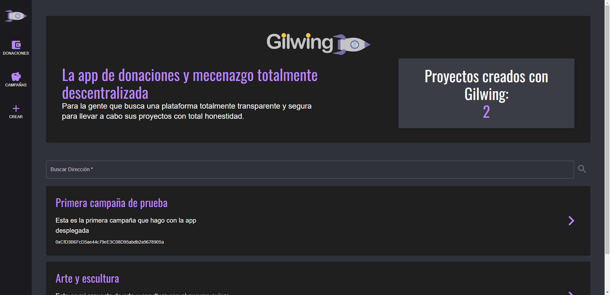

- **Crear**: Formulario para crear una campaña, nos pedirán un título, una descripción y una cantidad mínima de donaciones para la campaña.

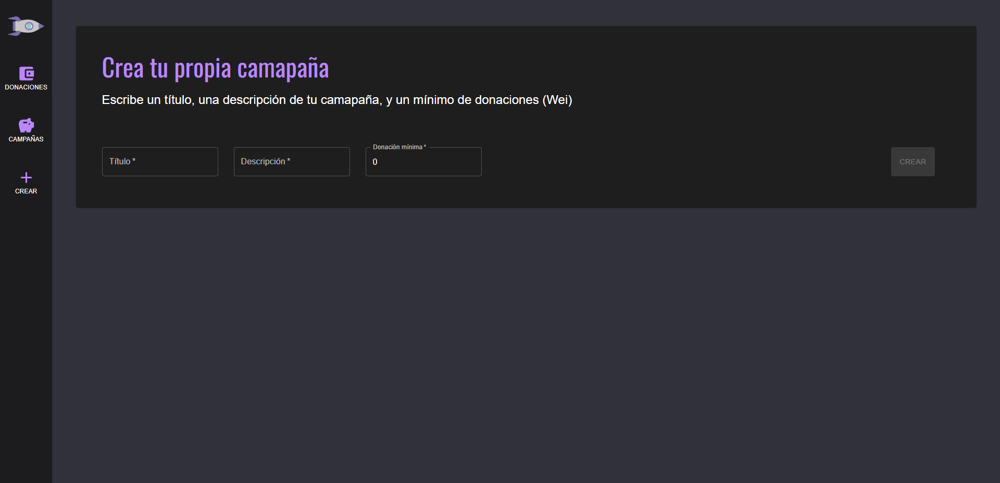

- **Mis campañas**: Lista de las campañas que has creado y de las que eres mánager.

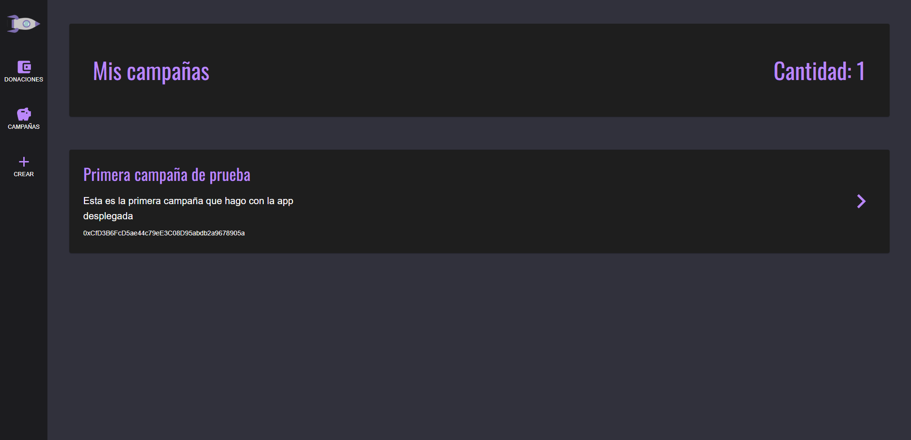

- **Mis donaciones**: Lista de las campañas a las que has donado.

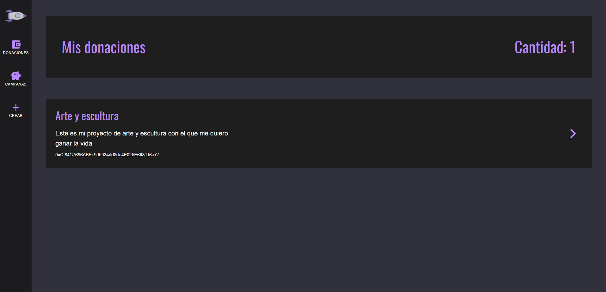

- **Campaign**: La página de detalles de la campaña donde prodrás ver las donaciones recibidas y las transacciones realizadas. Dependiendo de si eres el mánager o no, a la derecha aparecerá un formulario para donar o para hacer una transacción.

#### Despliegue

---

Con un servidor web cloud en IONOS se ha desplegado la aplicación utilizando Apache. Se generó una versión de producción en el servidor de la aplicación de react y se puso como directorio base en el archivo de configuración de apache.

Luego, usando Certbot se generó un certificado SSL para poder utilizar el protocolo **https**, principalmente para poder ser usado desde el navegador de Metamask en moviles, el cual solo hacepta este protocolo por motivos de seguridad.

### Resultados y conclusiones

---

Por lo general puedo decir que el proyecto ha resultado ser aproximadamente lo que esperaba. En general la cantidad de funcionalidades estimadas para el proyecto fueron las que al final se realizaron, habiendo algunas que se plantearon como posibles en el caso de que el tiempo fuera más que suficiente, las cuales finalmente se han descartado, como por ejemplo un sistema de votaciones para aceptar o denegar las transacciones, un sistema de devolución del dinero, y también algun sistema de recompensas automatizado.

Las únicas cosas que variaron de la visión inicial fue, por ejemplo, el sistema de perfiles de donaciones, el cual inicialmente ni se planteó, pero a medida que se diseñaba el smart contract vi que facilitaría mucho el sistema de donar varias veces con una misma cuenta.

Otro sistema que no plantee en un principio fue el de almacenamiento de Mis campañas y Mis donaciones ya que no se me ocurría una buena forma de hacerlo, pero durante el desarrollo me di cuenta de que podía utilizar la propia factory para almacenar las campañas que se requería, ya que actuaba como punto común entre todas las campañas.

En un futuro, como he mencionado antes se podrían añadir las funcionalidades de recompensas, votaciones y de devolución de ether. También una posible mejora a la personalización de las campañas, permitiendote modificar el título y descripción. Se podría añadir incluso una forma de subir imágenes a la campaña con el uso de urls, ya que en la blockchain no es recomendable el almacenamiento de imágenes.

### Bibliografía

- [Ethereum and Solidity: The Complete Developer's Guide](https://www.udemy.com/course/ethereum-and-solidity-the-complete-developers-guide/)

- [Stackoverflow](https://stackoverflow.co/)

- [Mui](https://mui.com/)
  