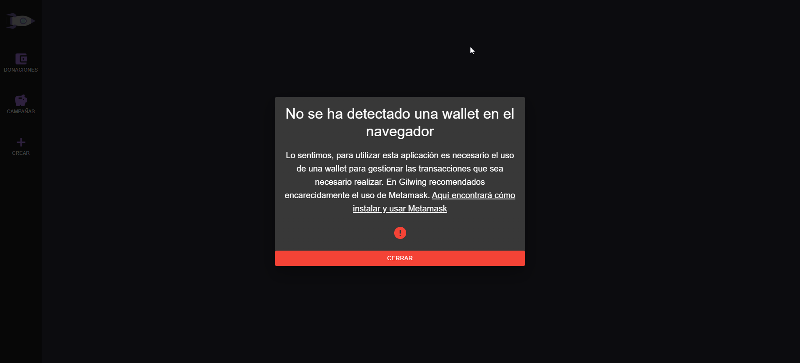
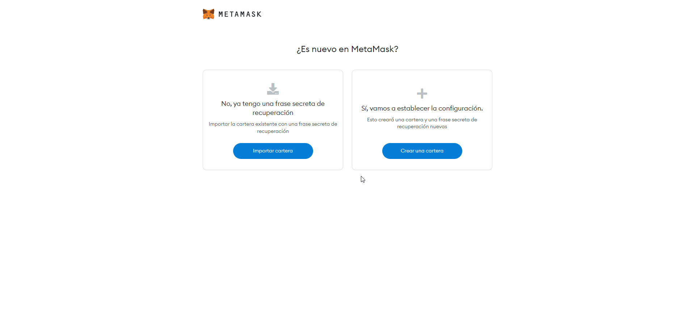
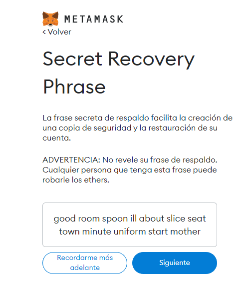
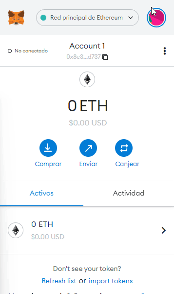
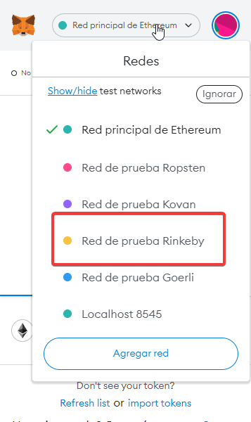
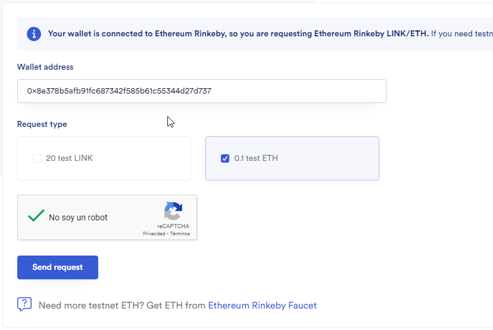
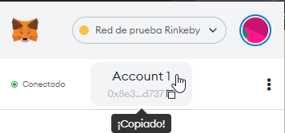
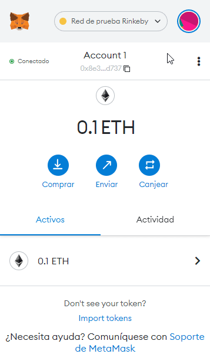
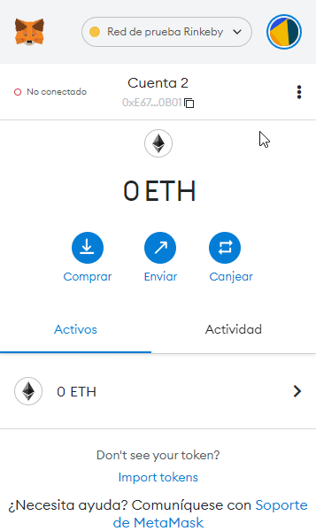

# Guia de inicio con Metamask

Es posible que hayas empezado a utilizar Gilwing sin haber tenido contacto con criptomonedas antes, y es algo normal. Es por eso que te recomendamos que sigas paso a paso esta guia de instalación y configuración de Metamask. Si se sigue como lo indicamos no debería de llevar más de 5 minutos.

## Modal de error

Es muy posible que al abrir la página nos encontremos con esta modal de error:

Esto significa, como dice la modal, que no tenemos en el navegador una wallet de criptomonedas instalada en el navegador. Metamask es el pilar principal de esta aplicación, ya que es el punto por el que ha de pasar el usuario para poder realizar las donaciones y crear campañas. Es probable que la aplicación funcione con otras wallets, pero la aplicación se ha hecho con Metamask en mente ya que es un estandar en este mundillo. **Recomendamos encarecidamente el uso de Metamask en esta aplicación.**

## Instalación de Metamask y creación de cartera

- Para empezar acudiremos a [la chrome web store](https://chrome.google.com/webstore/detail/metamask/nkbihfbeogaeaoehlefnkodbefgpgknn) para instalar Metamask en nuestro navegador como una extensión.

Una vez instalado lo abriremos y veremos la siguiente pantalla:

En el caso de que tengas una frase de recuperación y quieras usar tu cuenta principal en Gilwing, dale a la opción de la izquiera y sigue las instrucciones que se te indiquen.

- En este tutorial asumimos que NO tenemos aun una cartera, así que le damos a la opción  **CREAR UNA CARTERA**.

- En la siguiente opción le podemos dar a lo que queramos ya que no influye en el funcionamiento de la aplicación.

- Después de aceptar o denegar nos aparecerá un formulario de creación de contraseña. Pon la que desees y recuerdala.
  
Después de poner una contraseña aparecerá lo siguiente:

- La **Mnemonic phrase** es una frase formada por 12 palabras la cuál es la única forma que hay de acceder a tu cuenta y **NO SE PUEDE CAMBIAR NI RECUPERAR**, si quieres conservar esta cuenta y usarla en otros dispositivos recomendamos que se guarde, ya sea en una imagen o en un documento de texto. Con esta misma mnemonic phrase podremos generar infinidad de direcciones o cuentas, con cantidades de ether totalmente independientes y sin interconexión, excepto por la mnemonic phrase.
  
- Una vez continuemos nos pedirán que confirmemos la mnemonic phrase. El orden importa.

- Una vez validado, ¡Felicidades! ya tienes tu cuenta creada.

## Configuración de Metamask para Gilwing.

Gilwing funciona en la red de testing de ethereum, más concretamente en Rinkeby. Para que Gilwing pueda funcionar correctamente necesitaremos cambiar la red en la que trabaja metamask, que normalmente viene por defecto en la red principal.

**Recomiendo cerrar la pestaña donde se realizó la instalación y creación de cuenta y trabajar con la extensión del navegador directamente. Debería de aparece el icono arriba a la derecha para abrirlo.**

- Para activar la red de testeo seguiremos esta ruta:

Icono de perfil > Configuración > Avanzado > Show test networks

- Una vez activado, si le damos a la pestaña de arriba donde pone **Red principal de Ethereum** deberían de aparecernos multitud de redes. Seleccionaremos **Rinkeby**.

- Ahora que estamos en la red de testeo de Rinkeby necesitaremos algo de ether con el que poder trabajar. Acudiremos a este [faucet](https://faucets.chain.link/rinkeby) para recibir ether gratis para nuestra cuenta.

- Al entrar nos solicitará asociar la página a nuestra cuenta de ether. Aceptamos todo.

- Una vez aceptado todo el formulario se rellenará sólo con nuestra address, es importante desmarcar los **20 test LINK** y dejar marcado el ether a recibir, 0.1 puede parecer poco pero es suficiente para algunas pruebas **Este faucete requiere de esperar 1 hora para poder solicitar más ether, excepto si creas una [nueva cuenta](#múltiples-cuentas)**.

Si el formulario no se ha rellenado automáticamente podemos obtener nuestra address haciendo click aqui:

**Es normal que la solicitud suela durar entre 15 o 20 segundos, pasa con cualquier tipo de modificación de la blockchain, incluido en GILWING.**

- Una vez acabada la solicitud deberíamos de poder volver a Gilwing para poder trabajar en la red de testeo con el ether que acabamos de conseguir.

## Múltiples cuentas

Para poder crear una cuenta nueva, abriremos la pestaña de la extensión, clickaremos el icono de perfil y seleccionaremos Crear cuenta, pondremos cualquier nombre y pulsaremos Crear.

La cuenta viene por defecto desconectada, así que si pulsamos en el botón de estado y pulsamos Conectar podrémos conectarla y activarla como la cuenta en uso en ese momento.

Una vez conectada ya estará activada como la cuenta principal, si queremos volver a cambiar podemos pulsar en el icono de perfil y seleccionamos otra. Al crear una cuenta nueva, cabe destacar que se puede aprovechar para solicitar ethereum nuevamente en el faucet antes mencionado, ya que la limitación funciona en base al address de la cuenta a la que se envía.

## Móviles

Gilwing no puede ser utilizado desde cualquier navegador en el caso de que queramos utilizarlo desde móviles. Siempre que queramos acceder a la app desde un dispositivo móvil tendremos que hacerlo desde la aplicación de Metamask, la cual nos aporta un navegador con una wallet incorporada. La configuración es la misma que desde un navegador, usamos la red de testeo Rinkeby y el usuario puede ser nuevo o el mismo que en el navegador de sobremesa en el caso de que hayamos guardado la mnemonic phrase durante la creacion de esta.